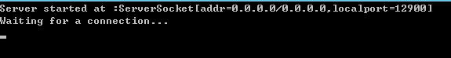
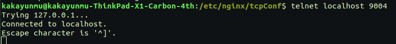
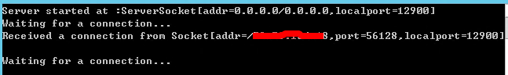
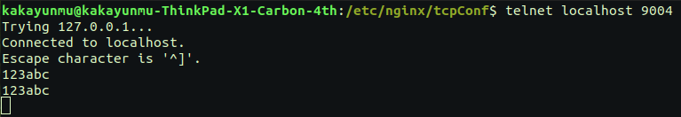
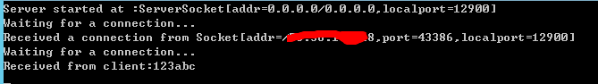

# 测试nginx TCP转发功能
测试目标：我们配置2台服务器作为tcp服务，一台服务器为nginx转发服务器，然后使用tcp客户端链接nginx服务器，验证tcp请求是否能正确转发到tcp服务器。
## 1、安装nginx
```shell
	sudo apt install nginx
```
检查安装版本,并查看是否已启用stream模块（包含--with-stream）
```shell
	nginx -V
```
## 2、准备一个简单的测试服务
使用java编写一个简单的TCP服务，主要代码如下：
```java
	import java.io.*;
	import java.net.InetSocketAddress;
	import java.net.ServerSocket;
	import java.net.Socket;

	public class Main {
		public static void main(String[] args) throws IOException {
		ServerSocket serverSocket=new ServerSocket(12900,100);
		System.out.println("Server started at :"+serverSocket);

		while (true){
			System.out.println("Waiting for a connection...");
			final Socket activeSocket=serverSocket.accept();
			System.out.println("Received a connection from "+activeSocket);
			Runnable runnable=()->handleClientRequest(activeSocket);
			new Thread(runnable).start();
		}
		}

		public static void handleClientRequest(Socket socket){
		try{
			BufferedReader socketReader=null;
			BufferedWriter socketWriter=null;
			socketReader=new BufferedReader(new InputStreamReader(socket.getInputStream()));
			socketWriter=new BufferedWriter(new OutputStreamWriter(socket.getOutputStream()));

			String inMsg=null;
			while ((inMsg=socketReader.readLine())!=null){
			System.out.println("Received from client:"+inMsg);

			String outMsg=inMsg;
			socketWriter.write(outMsg);
			socketWriter.write("\n");
			socketWriter.flush();
			if("exit".equals(inMsg)){
				break;
			}
			}
			socket.close();
		}catch (Exception e){
			e.printStackTrace();
		}
		}
	}
```
开启一个socket服务监听服务器所有IP地址的12900端口，并设置100个等待队列大小，如果有客户端链接上服务则打印*Received a connection from+客户端信息*到控制台，客户端输入任何内容，服务端将内容原封不动返回给客户端，如果客户端输入**exit**字符，服务端则关闭socket链接。
## 3、配置tcp服务器
配置服务并启动



## 4、配置nginx
apt方式安装的 nginx 配置文件默认在 **/etc/nginx/** 文件夹下，打开主配置文件 **nginx.conf** 添加如下代码
```
stream{
        include tcpConf/*.conf;
}

```
然后在tcpConf文件夹下创建我们用于测试的配置文件
```shell
mkdir tcpConf
cd tcpConf
vim 12900.conf
```
12900.conf添加如下配置
```
upstream tcp12900{
        server tcp测试服务1IP:12900;
        server tcp测试服务2IP:12900;
}

server{
        listen 9004;
        proxy_connect_timeout 2s;
        proxy_timeout 1h;
        proxy_pass tcp12900;
}

```

## 5、测试
我现在安装nginx服务的这台服务器上使用**telnet**命令测试
```shell
telnet localhost 9004
```


看样子是链接上了，我们上tcp服务器看看他是连接的哪个


链接到我们tcp服务器1上了，我们再启动一个tcp客户端并发送 **123abc** 字符串到服务器


我们发送了**123abc**到服务器，服务器给我们返回了**123abc**回来，再看下这次是链接的哪台服务器


这次链接了另外一台。

## 6、结论
使用nginx配置 tcp分发是可行的，而且具有容错处理机制。我将其中一台tcp服务关掉然后再发起tcp请求，所有请求都会自动转到正常的tcp服务器上。

下章研究下nginx的分发策略